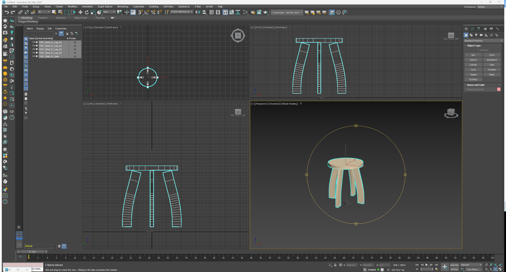
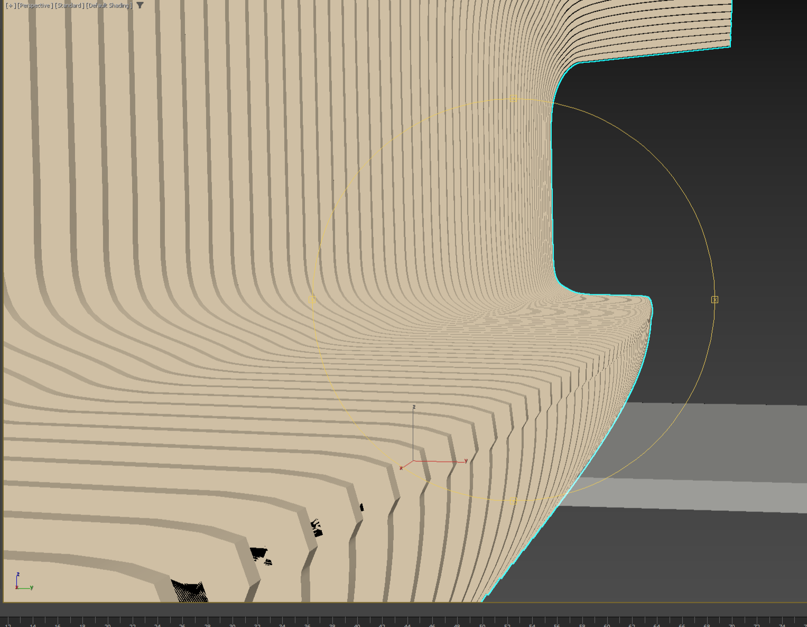
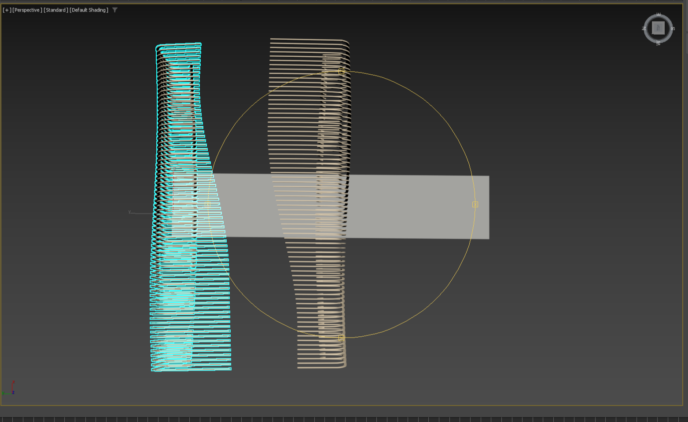
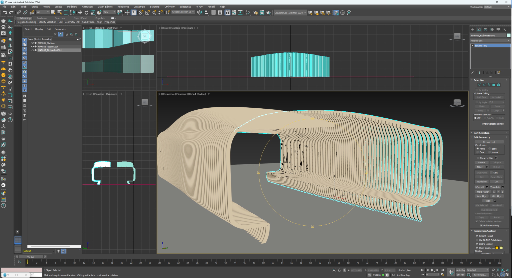

# Direct LLM Modeling in Autodesk 3ds Max

[English research](RESEARCH_EN.md) · [Исследование на русском](RESEARCH_RU.md)

**A working experiment in direct 3D modeling from natural-language descriptions using ChatGPT and Autodesk 3ds Max 2024.**

No autonomous agent framework.  
No specialized 3D model.  
No text-to-3D generator.  
No custom modeling environment.  
No manual copy-paste of generated code into 3ds Max during the working loop.

The system connects ChatGPT to a locally running Autodesk 3ds Max through **Google Drive as a third-party synchronized transport layer** and an approximately **8 KB Python/pymxs bridge**.

## Closed modeling loop

```text
Natural-language task
        ↓
     ChatGPT
        ↓
   Google Drive
        ↓ local sync
~8 KB Python/pymxs bridge
        ↓
Autodesk 3ds Max 2024
        ↓
native editable geometry
        ↓
result + scene state + viewport
        ↓
   Google Drive
        ↓
     ChatGPT
        ↺ next iteration
```

Google Drive contains no modeling logic. The bridge contains no modeling intelligence and no predefined commands such as “make a chair”, “make a facade”, or “make a building”. It transports executable operations to 3ds Max and returns observable results.

**The modeling decisions remain on the general-purpose LLM side. The geometry remains on the 3ds Max side.**

The output is ordinary **native, editable Autodesk 3ds Max geometry**.

## Research question

The experiment began as a practical test:

> **Can a general-purpose language model work directly as a modeler inside a professional 3D environment?**

It was not a test of whether an LLM can write a 3ds Max script for a human to copy and run. The goal was to close the loop: task → modeling operation → actual scene → viewport → evaluation → next modeling operation.

## What was demonstrated

### 01 — Control object: stool

A simple stool was used as a controlled modeling task. The process included professional correction of the modeling method, creation of native geometry, and export of the construction logic as an autonomous Python/pymxs scene program.



### 02 — Transfer of a professional modeling method

The architect then explained a reusable professional technique rather than supplying an object to copy: one source profile/object, a rule of spatial or parametric change, repeated sampled states, and cleanup into usable native geometry.

ChatGPT applied the learned logic to a new task: a large slatted urban-furniture / shade-seat module.



The result was then duplicated, rotated and placed in a larger spatial composition in 3ds Max.





The intermediate failures are part of the experiment: professional feedback changed the **modeling method**, not merely a list of coordinates.

### 03 — Executable scene representation

The stool experiment produced a second research question: does the scene itself have to be transmitted as a traditional scene file?

The modeled object was represented as an autonomous Python/pymxs program. A separate clean instance of 3ds Max, without the bridge and without the source scene, reconstructed the editable object from that program.

> **An ordinary scene stores a state of the world. An executable scene can store the rules by which that state is produced.**

Or, more simply:

> **The scene itself can be transmitted as a program.**

## Read the research

- [Full research — English](RESEARCH_EN.md)
- [Полный текст исследования — русский](RESEARCH_RU.md)
- [Setup and reproduction](docs/SETUP.md)
- [Professional modeling-method transfer](docs/MODELING_METHOD.md)
- [Transport/file protocol](protocol/FILES.md)

## Repository contents

- `bridge/` — compact working 0.6.1 Python/pymxs bridge, **234 lines / 7,785 bytes** in this publication.
- `examples/01_stool/` — autonomous stool construction script.
- `examples/02_method_transfer_maf/` — independent post-training MAF construction script.
- `media/` — viewport evidence from the experiment.
- `docs/` — setup and modeling-method documentation.
- `protocol/` — transport contract and command examples.

## Scope and related work

This repository does **not** claim to be the first integration between an LLM and Autodesk 3ds Max. Earlier and contemporary projects have connected language models or agent systems to 3ds Max through scripting, plugins, or MCP-style tool layers.

The focus of this experiment is the specific demonstrated combination: a general-purpose ChatGPT model used from its ordinary interface, a deliberately minimal ~8 KB transport bridge, Google Drive as a third-party synchronized transport layer, a closed scene-state/viewport feedback loop, native editable 3ds Max geometry, professional method transfer through dialogue, and executable scene representation.

The repository therefore documents an experiment and its reproducible artifacts rather than a priority claim.

## Status

This repository documents an ongoing practical experiment. It makes no claim that this is the first LLM-to-3ds-Max integration. The focus is the demonstrated combination of a general-purpose ChatGPT model, a deliberately minimal transport bridge, a third-party synchronized storage layer, native editable 3ds Max geometry, visual/state feedback, professional method transfer, and executable scene representation.

A license has not yet been selected.
